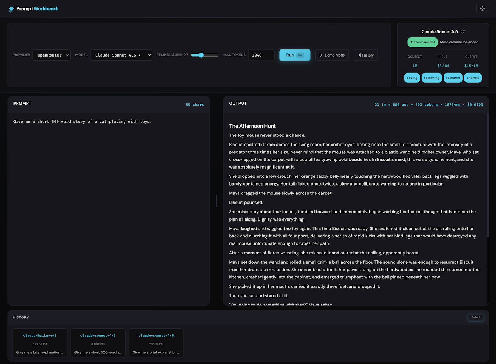
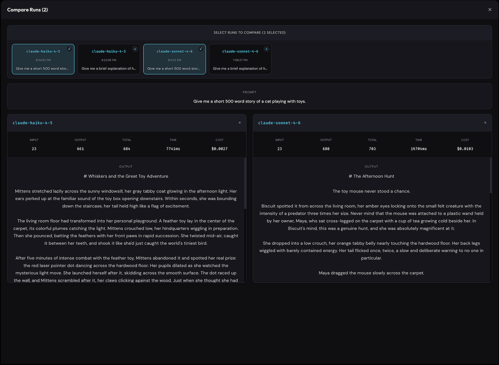

# Prompt Workbench

A modern, dark-themed LLM experimentation tool for comparing model outputs across providers like OpenAI, Anthropic, Google, Meta, and more. Built with React and Vite.



## Features

- **Multi-Provider Support**: Connect to OpenAI, Anthropic, Google, Meta, Mistral, DeepSeek, and MiniMax via OpenRouter
- **Local Models**: Run local models via LM Studio or Ollama
- **Model Comparison**: Select multiple runs and compare outputs side-by-side
- **Cost Tracking**: See token usage and estimated costs per run
- **History Management**: Save and revisit past prompt runs
- **Demo Mode**: Try the app with sample prompts before configuring API keys
- **Responsive Design**: Works on desktop and tablet

## Screenshots

### Main Interface


### Compare Runs View


## Installation

### Prerequisites
- Node.js 18+ and npm

### MacOS / Linux

1. Clone the repository:
```bash
git clone <your-repo-url>
cd prompt-workbench
```

2. Install dependencies:
```bash
npm install
```

3. Start the development server:
```bash
npm run dev
```

4. Open [http://localhost:5173](http://localhost:5173) in your browser

### Windows

1. Clone the repository:
```powershell
git clone <your-repo-url>
cd prompt-workbench
```

2. Install dependencies:
```powershell
npm install
```

3. Start the development server:
```powershell
npm run dev
```

4. Open [http://localhost:5173](http://localhost:5173) in your browser

## Configuration

### OpenRouter API Key (Recommended)

1. Click the **Settings** button (gear icon) in the header
2. Select **OpenRouter** as the provider
3. Enter your [OpenRouter API key](https://openrouter.ai/keys)
4. Click **Save**

All cloud providers (OpenAI, Anthropic, Google, etc.) route through OpenRouter, so you only need one API key.

### Local Models

To use local models via LM Studio or Ollama:

1. Start LM Studio or Ollama on your machine
2. Click **Settings** and select **LM Studio** or **Ollama**
3. Choose your model from the dropdown
4. Click **Save**

## Usage

1. **Select a Provider**: Choose OpenRouter or a local provider from the dropdown
2. **Choose a Model**: Select from available models (recommended models marked with ★)
3. **Adjust Settings**: Set temperature and max tokens as needed
4. **Enter a Prompt**: Type your prompt in the left panel
5. **Run**: Click **Run** or press `Cmd/Ctrl + Enter`
6. **View Output**: See the response in the right panel with stats

### Comparing Runs

1. Click **Select** in the History panel
2. Click on history items to select them for comparison
3. Use the action buttons to **Compare** or **Delete** selected items
4. In the Compare modal, you can adjust your selection and see outputs side-by-side

## Build for Production

```bash
npm run build
```

The built files will be in the `dist/` directory.

## Tech Stack

- React 18
- Vite
- CSS Custom Properties for theming

## Author

Victor Gutierrez
